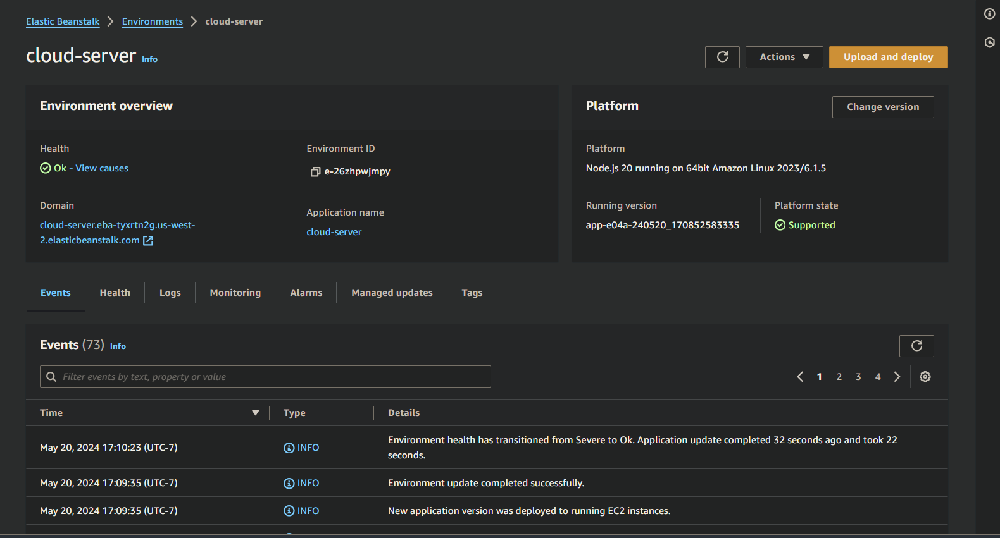

# cloud-server
AWS: Cloud Servers

screenshot of EB deployment: 

- [GUI deploy link](f): not there but should work, John and Brandon saw the DB deployment work
- [CLI deploy link](f): http://cloud-server.eba-tyxrtn2g.us-west-2.elasticbeanstalk.com/

Feature Tasks
Deploy a simple Node.js server to EC2, using Elastic Beanstalk

Choose a server you’ve built previously
Option 1: A simple API or Web Server
Option 2: A socket.io event Hub
The server should not require a database
Check in your server to GitHub
Task 1:

Create a new environment, using Elastic Beanstalk from the AWS Control Panel (GUI)
Manually deploy your application to this environment by uploading a .zip file
Task 2:

Using the same server, create a new environment using Elastic Beanstalk from your terminal
Manually deploy your application to this environment by using eb deploy
